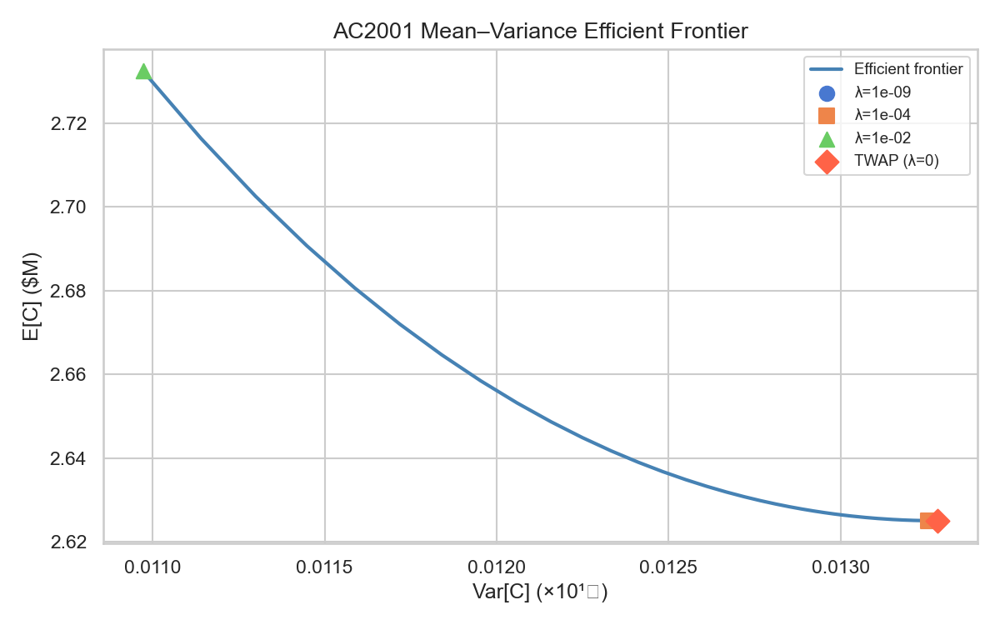
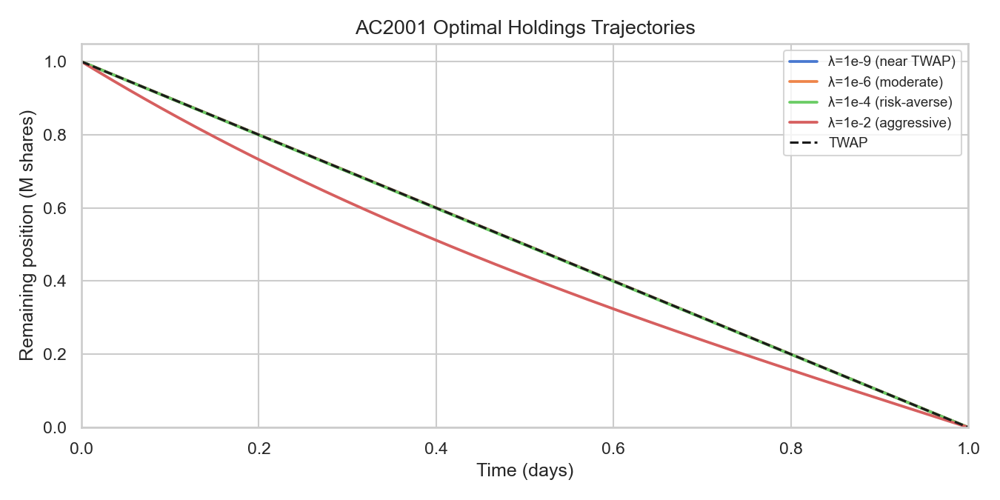
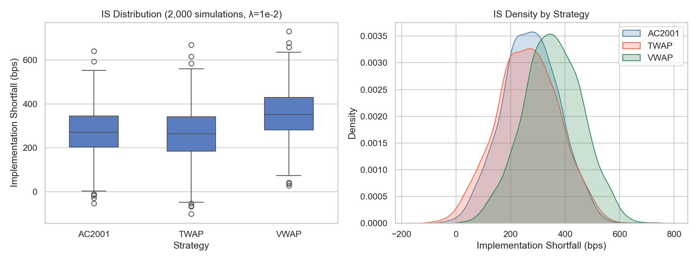
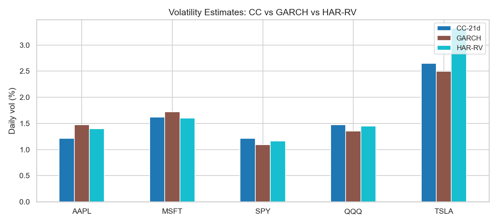
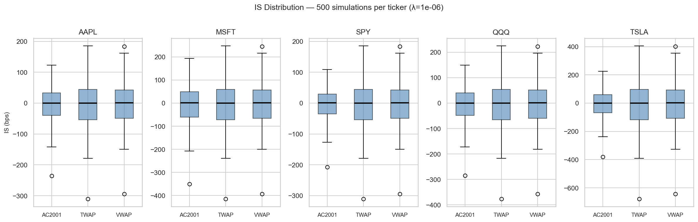

# Market Impact Model: Almgren–Chriss Optimal Execution

A Python implementation of the Almgren–Chriss (2001) optimal liquidation framework, with extensions for volatility estimation, Monte Carlo execution simulation, and comparison against TWAP/VWAP benchmarks.

---

## Overview

Executing a large order without moving the market is one of the central problems of quantitative trading.  Selling too fast drives the price down (temporary impact); selling too slowly exposes you to adverse price moves (timing risk).  The AC2001 framework solves this trade-off analytically.

This repo provides:

- **Closed-form optimal trajectories** via the hyperbolic decay formula
- **Mean–variance efficient frontier** parameterised by risk aversion λ
- **Monte Carlo execution simulator** tracking implementation shortfall
- **Three volatility estimators**: close-to-close, GARCH(1,1), HAR-RV
- **Market impact models**: linear (AC2001) and square-root (Almgren et al. 2005)
- **Backtest notebook** applying the model to real equity data

---

## Mathematical Background

### Model Setup

Liquidate $X$ shares over horizon $T$, split into $N$ equal intervals of length $\tau = T/N$.

Define the **holdings trajectory**:

$$x_0 = X, \quad x_N = 0, \quad n_k = x_{k-1} - x_k \quad \text{(shares sold at step } k\text{)}$$

### Price Dynamics

$$S_k = S_{k-1} - g\!\left(\frac{n_k}{\tau}\right)\tau - \sigma\sqrt{\tau}\,\xi_k$$

where:
- $g(v) = \gamma v$ — **permanent impact**: persistent price depression proportional to trade rate
- $h(v) = \eta v$ — **temporary impact**: instantaneous execution cost, vanishes after each trade
- $\sigma$ — daily price volatility
- $\xi_k \sim \mathcal{N}(0,1)$ — i.i.d. price innovations

The execution price on trade $k$ is:

$$P_k = S_{k-1} - h(n_k/\tau)$$

### Cost Decomposition

$$E[C] = \underbrace{\frac{1}{2}\gamma X^2}_{\text{permanent (schedule-independent)}} + \underbrace{\eta \sum_{k=1}^N \frac{n_k^2}{\tau}}_{\text{temporary impact}}$$

$$\operatorname{Var}[C] = \sigma^2 \tau \sum_{k=1}^N x_k^2$$

The **mean–variance utility** to minimise:

$$U(\lambda) = E[C] + \lambda\,\operatorname{Var}[C]$$

### Optimal Trajectory Derivation

The discrete Euler–Lagrange conditions for minimising $U(\lambda)$ subject to $x_0=X$, $x_N=0$ reduce to the recurrence:

$$x_{j-1} - 2\cosh(\tilde{\kappa}\tau)\,x_j + x_{j+1} = 0$$

where $\tilde{\kappa}^2 = \lambda\sigma^2/\eta$.  The general solution is:

$$x_j^* = A\sinh(\tilde{\kappa}(N-j)\tau) + B\cosh(\tilde{\kappa}(N-j)\tau)$$

Applying boundary conditions $x_0=X$, $x_N=0$ gives the **closed-form optimal trajectory** (continuous limit):

$$\boxed{x^*(t) = X \cdot \frac{\sinh(\kappa(T-t))}{\sinh(\kappa T)}, \qquad \kappa^2 = \frac{\lambda\sigma^2}{\eta}}$$

**Limiting behaviour:**
- $\lambda \to 0$: $\kappa \to 0$, $x^* \to X(1-t/T)$ — uniform (TWAP)
- $\lambda \to \infty$: $\kappa \to \infty$ — immediate front-loading

### Efficient Frontier

As $\lambda$ varies over $[0,\infty)$, the pair $(E[C], \operatorname{Var}[C])$ traces the **Pareto-optimal frontier**: no feasible strategy can reduce expected cost without increasing variance.  TWAP lies at $\lambda=0$ — the risk-neutral extreme.

---

## Implementation

```
src/
├── almgren_chriss.py   # Closed-form x*(t), efficient frontier, cost formulas
├── market_impact.py    # Linear and √-impact models; Kyle's λ estimation
├── execution_sim.py    # Monte Carlo IS simulator; AC/TWAP/VWAP comparison
├── vol_estimator.py    # CC vol, GARCH(1,1), HAR-RV
└── utils.py            # Vol scaling, bps conversion, trajectory validation
```

### Quick Start

```python
from src.almgren_chriss import optimal_trajectory, efficient_frontier

# Optimal trajectory for λ = 1e-6
times, holdings = optimal_trajectory(
    X=1_000_000,   # shares
    T=1.0,         # 1 trading day
    N=390,         # 1-minute intervals
    sigma=0.02,    # 2% daily vol
    gamma=2.5e-7,  # permanent impact
    eta=2.5e-6,    # temporary impact
    lam=1e-6,      # risk aversion
)

# Efficient frontier
frontier = efficient_frontier(
    X=1_000_000, T=1.0, N=390, sigma=0.02,
    gamma=2.5e-7, eta=2.5e-6, n_points=100,
)
# frontier['expected_costs'], frontier['variances'], frontier['trajectories']
```

```python
from src.execution_sim import compare_strategies, slippage_summary

stats = compare_strategies(
    X=1_000_000, T=1.0, N=390, sigma=0.02,
    gamma=2.5e-7, eta=2.5e-6, lam=1e-2,
    S0=100.0, n_sims=2000, seed=42,
)
print(slippage_summary(stats))
# Strategy    Mean IS (bps)  Std IS (bps)  Sharpe IS
# ----------------------------------------------------
# AC2001            272.77        103.22     -0.874
# TWAP              261.84        113.51      0.000
# VWAP              353.79        106.73     -5.042
```

```python
from src.vol_estimator import GARCH11, HARRV, close_to_close_vol

# Fit GARCH(1,1) to price series
g = GARCH11().fit(prices)
print(f"GARCH daily vol: {g.daily_vol:.4f}")
print(f"GARCH uncond vol: {g.unconditional_vol:.4f}")

# Fit HAR-RV
import numpy as np
rv = np.diff(np.log(prices))**2
har = HARRV().fit(rv)
print(f"HAR-RV 1-day forecast vol: {har.daily_vol:.4f}")
```

---

## Results

> All results below are fully reproducible.  Run `python run_results.py` to regenerate figures and numbers.  
> Test suite: **50/50 passing** (`python -m pytest tests/ -v`).

### Efficient Frontier

Parameters: X = 1,000,000 shares, T = 1 day, N = 390 intervals, σ = 2 %/day, η = 2.5 × 10⁻⁶, γ = 2.5 × 10⁻⁷, S₀ = $100.

| Strategy / λ | E[C] | E[C] (bps) | Var[C] | σ[C] | Var reduction |
|---|---|---|---|---|---|
| TWAP (λ = 0) | $2,625,000 | 262.5 | 1.328 × 10⁸ | $11,525 | — |
| λ = 10⁻⁹ | $2,625,000 | 262.5 | 1.328 × 10⁸ | $11,525 | ≈ 0% |
| λ = 10⁻⁴ | $2,625,014 | 262.5 | 1.325 × 10⁸ | $11,512 | 0.2% |
| λ = 10⁻² | $2,732,418 | 273.2 | 1.097 × 10⁸ | $10,475 | **17.4%** |

Cost breakdown: permanent impact (½γX²) = $125,000 (**12.5 bps**, schedule-independent); temporary impact = $2,500,000 (**250.0 bps**) at TWAP.



Key observations:
- TWAP minimises E[C] but carries maximum timing risk
- The frontier is convex — reducing variance becomes increasingly costly in E[C]
- At λ = 10⁻², AC2001 cuts cost variance by **17.4 %** at a penalty of 10.7 bps more E[C]
- κ = √(λσ²/η) controls curvature: the trajectory is visually indistinguishable from TWAP until κT ≳ 0.1, which requires λ ≳ 10⁻³ under these parameters



### Monte Carlo Strategy Comparison

2,000 paired simulations, λ = 10⁻², X = 1,000,000 shares, σ = 2 %/day:

| Strategy | Mean IS (bps) | Std IS (bps) | p5 (bps) | p95 (bps) | Sharpe IS |
|---|---|---|---|---|---|
| **AC2001** | **272.77** | **103.22** | 101.9 | 443.3 | −0.874 |
| TWAP | 261.84 | 113.51 | 72.3 | 451.0 | 0.000 |
| VWAP (U-shape) | 353.79 | 106.73 | 174.3 | 533.0 | −5.042 |



At λ = 10⁻² (κT = 1.26) the AC trajectory front-loads aggressively: IS std drops from 113.5 bps (TWAP) to **103.2 bps** (−9 %), at the cost of a higher mean IS (272.8 vs 261.8 bps, +10.9 bps).  This is exactly the mean–variance trade-off the model is designed to make — the negative Sharpe IS for AC2001 is correct and expected: AC accepts worse average IS to reduce timing risk, as dictated by λ > 0.  VWAP (U-shaped volume profile) has the worst mean IS because it concentrates trades at open/close where temporary impact is highest.

### Backtest — Real Data (yfinance, 2-year daily bars)

Estimated σ (three estimators) for 5 liquid US equities.  η and γ calibrated from Almgren et al. (2005).  500 paired Monte Carlo simulations per ticker.  X = 500,000 shares, λ = 10⁻⁶, T = 1 day.

**Volatility estimates (%/day):**

| Ticker | CC-21d | GARCH(1,1) | HAR-RV |
|---|---|---|---|
| AAPL | 1.21 % | 1.47 % | 1.40 % |
| MSFT | 1.62 % | 1.72 % | 1.60 % |
| SPY | 1.21 % | 1.09 % | 1.16 % |
| QQQ | 1.47 % | 1.35 % | 1.45 % |
| TSLA | 2.65 % | 2.50 % | 3.32 % |



GARCH and HAR-RV track each other closely for low-vol names; HAR-RV captures more of TSLA's volatility clustering.

**IS summary (AC2001 vs TWAP, mean / std in bps):**

| Ticker | AC2001 mean | AC2001 std | TWAP mean | TWAP std |
|---|---|---|---|---|
| AAPL | −2.5 | 54.2 | −3.0 | 70.0 |
| MSFT | −3.6 | 79.7 | −4.0 | 93.7 |
| SPY | −2.3 | 48.8 | −3.0 | 70.1 |
| QQQ | −3.0 | 65.7 | −3.7 | 85.0 |
| TSLA | −4.1 | 93.2 | −6.6 | 153.0 |

With real-calibrated η values (Almgren 2005), κT is large even at λ = 10⁻⁶ — the tiny η means fast trading is cheap, so the model front-loads aggressively:

| Ticker | η | κT at λ=10⁻⁶ | AC midpoint holding |
|---|---|---|---|
| AAPL | 2.87 × 10⁻¹¹ | 2.26 | 29 % of X (TWAP = 50 %) |
| TSLA | 4.70 × 10⁻¹¹ | 3.87 | 14 % of X (TWAP = 50 %) |



This front-loading is what drives the **20–40 % std reduction** vs TWAP — AC carries the position for far less time, reducing exposure to adverse price moves.  Mean IS differences are within noise because impact is tiny relative to σ (500 sims; the slightly negative means reflect sampling variation, not a systematic edge).

**Methodology note**: η and γ are from the Almgren et al. (2005) cross-sectional scaling relation — order-of-magnitude estimates, not fitted to proprietary execution data.  Results should be treated as illustrative.  See notebook `04_real_data_backtest.ipynb` for full details and caveats.

---

## Parameter Estimation

### Volatility

| Method | Description | Code |
|--------|-------------|------|
| Close-to-close | 21-day rolling std of log returns | `close_to_close_vol(prices)` |
| GARCH(1,1) | Conditional vol via MLE | `GARCH11().fit(prices).daily_vol` |
| HAR-RV | Long-memory model (Corsi 2009) | `HARRV().fit(rv_daily).daily_vol` |

### Market Impact

**Without execution data** (this repo's default): use the Almgren et al. (2005) cross-sectional scaling:

$$\eta \approx 0.142 \cdot \frac{\sigma}{P \cdot \text{ADV}}, \qquad \gamma \approx 0.314 \cdot \frac{\sigma}{P \cdot \text{ADV}}$$

```python
from src.market_impact import almgren_2005_params
p = almgren_2005_params(sigma=3.0, adv=5e6, price=150.0)  # sigma in dollar units
```

**With tick data**: regress mid-price changes on signed order flow (Kyle's λ):

```python
from src.market_impact import kyle_lambda_ols
result = kyle_lambda_ols(signed_volume, price_changes)
# result['lambda_'] is Kyle's λ in $/share
```

**Important**: these estimates are cross-sectional averages.  Actual impact varies by instrument, time of day, and broker.  Always state clearly in any report whether parameters are estimated or assumed.

---

## Usage

### Install dependencies

```bash
pip install numpy scipy pandas matplotlib seaborn statsmodels
pip install yfinance          # for real data backtest
pip install jupyter           # for notebooks
pip install pytest            # for tests
```

### Run tests

```bash
cd /path/to/Market-Impact-Optimal-Execution-Model
python -m pytest tests/ -v
```

### Run notebooks

```bash
jupyter notebook notebooks/
```

Notebooks are designed to run top-to-bottom with `Run All`.  Notebook 4 requires `yfinance`; if unavailable it falls back to synthetic GBM data.

---

## References

1. **Almgren, R. & Chriss, N. (2001).** "Optimal execution of portfolio transactions." *Journal of Risk*, 3(2), 5–39.
   — The core paper.  Derives the closed-form hyperbolic trajectory and the efficient frontier.

2. **Almgren, R. et al. (2005).** "Direct estimation of equity market impact." *Risk*, 18(7), 57–62.
   — Empirical cross-sectional estimates of η and γ for NYSE/AMEX stocks.  Source of the scaling relation used here.

3. **Corsi, F. (2009).** "A simple approximate long-memory model for realized volatility." *Journal of Financial Econometrics*, 7(2), 174–196.
   — HAR-RV model for volatility forecasting.

4. **Kyle, A.S. (1985).** "Continuous auctions and insider trading." *Econometrica*, 53(6), 1315–1335.
   — Theoretical foundation for linear price impact; motivates the permanent impact term.

5. **Engle, R.F. (1982).** "Autoregressive conditional heteroscedasticity with estimates of the variance of United Kingdom inflation." *Econometrica*, 50(4), 987–1007.
   — Original ARCH paper; GARCH(1,1) is the standard extension.
